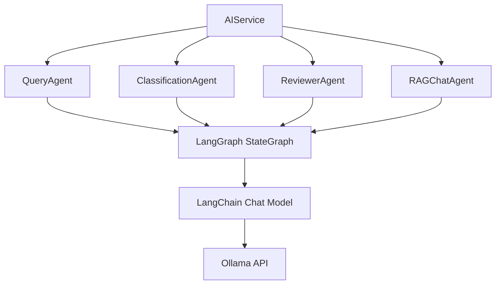

# 基于 LangChain/LangGraph 的 Agents 重构说明

## 概述

本次重构使用 **LangChain** 和 **LangGraph** 框架重新实现了所有AI Agents，并删除了 `ai_responder.py`，将其所有功能整合到 `ai_service.py` 中。

---

## 🎯 重构目标

1. ✅ 使用 LangChain 和 LangGraph 实现所有 Agents
2. ✅ 删除 `ai_responder.py`，功能整合到 `ai_service`
3. ✅ 保持向后兼容性
4. ✅ 提升代码的可维护性和可扩展性

---

## 📁 变更内容

### 1. 删除的文件

- ❌ `src/services/ai_responder.py` - 已删除

### 2. 重构的文件

#### Agents (基于 LangGraph 实现)

**`src/agents/query.py`** - 题目查询 Agent
- 使用 `StateGraph` 定义工作流状态
- 实现两个节点：
  - `generate_answer_node`: 生成答案
  - `evaluate_confidence_node`: 评估置信度（可选）
- 条件边：根据 `return_confidence` 决定是否评估置信度

**工作流程**:
```
generate_answer → [是否评估置信度？] 
    ├─ 是 → evaluate_confidence → END
    └─ 否 → END
```

**`src/agents/classification.py`** - 题目分类 Agent
- 使用 `StateGraph` 定义分类流程
- 实现两个节点：
  - `classify_node`: 调用 LLM 进行分类
  - `parse_results_node`: 解析 JSON 结果

**工作流程**:
```
classify → parse_results → END
```

**`src/agents/reviewer.py`** - 答案复审 Agent
- 使用 `StateGraph` 定义复审流程
- 实现两个节点：
  - `review_node`: 调用 LLM 进行复审
  - `parse_result_node`: 解析 JSON 结果

**工作流程**:
```
review → parse_result → END
```

**`src/agents/rag_chat.py`** - RAG 对话 Agent
- 使用 `StateGraph` 定义 RAG 流程
- 实现两个节点：
  - `retrieve_node`: 检索相关文档
  - `generate_node`: 基于上下文生成回答

**工作流程**:
```
retrieve → generate → END
```

#### Services

**`src/services/ai_service.py`** - AI服务（整合版）
- ✅ 保留原有 `AIService` 的所有方法
- ✅ 整合原 `AIResponder` 的所有方法：
  - `generate_answer()` - 生成答案
  - `generate_answer_with_confidence()` - 生成答案并评估置信度
  - `batch_generate_answers()` - 批量生成答案
  - `get_ai_statistics()` - 获取统计信息
  - `clear_ai_history()` - 清空历史

---

## 🔧 使用的 LangChain/LangGraph 组件

### 核心组件

1. **StateGraph** (`langgraph.graph`)
   - 定义工作流的状态图
   - 支持添加节点和边
   - 支持条件分支

2. **END** (`langgraph.graph`)
   - 结束节点标记

3. **TypedDict** (`typing`)
   - 定义状态类型
   - 提供类型检查

4. **SystemMessage/HumanMessage** (`langchain_core.messages`)
   - 构建对话消息
   - 区分系统提示和用户输入

5. **ChatPromptTemplate** (`langchain_core.prompts`)
   - 可选：用于构建复杂的提示词模板

### LLM 集成

使用项目中已有的 `llm.chat` 模块：
- 基于 `langchain_ollama.ChatOllama`
- 支持 invoke、stream 等多种调用方式

---

## 💡 使用示例

### 示例 1：简单回答（使用 AIService）

```python
from services.ai_service import ai_service

# 生成答案（原 AIResponder.generate_answer）
answer = ai_service.generate_answer(
    question="什么是人工智能？",
    options=["A. 机器学习", "B. 深度学习"],
    question_type="single"
)
print(f"答案：{answer}")
```

### 示例 2：带置信度的回答

```python
from services.ai_service import ai_service

# 生成答案并评估置信度（原 AIResponder.generate_answer_with_confidence）
result = ai_service.generate_answer_with_confidence(
    question="中国梦是什么？",
    question_type="completion"
)
print(f"答案：{result['answer']}")
print(f"置信度：{result['confidence']}")
print(f"推理：{result['reasoning']}")
```

### 示例 3：完整流程（分类→回答→复审）

```python
from services.ai_service import ai_service

result = ai_service.full_process(
    question="矛盾论是谁提出的？",
    question_type="judgement"
)
print(f"分类：{result['categories']}")
print(f"最终答案：{result['final_answer']}")
print(f"复审结果：{result['review_result']}")
```

### 示例 4：直接使用 QueryAgent

```python
from agents.query import query_agent

# 简单回答
result = query_agent.answer(
    question="什么是物联网？",
    question_type="essay"
)
print(f"答案：{result['answer']}")

# 带置信度的回答
result = query_agent.answer(
    question="什么是物联网？",
    return_confidence=True
)
print(f"答案：{result['answer']}")
print(f"置信度：{result['confidence']}")
```

### 示例 5：RAG 对话

```python
from services.ai_service import ai_service

response = ai_service.chat(
    query="马克思主义的基本原理有哪些？",
    use_history=True
)
print(f"回答：{response['answer']}")
print(f"参考来源：{response['sources']}")
```

---

## 🔄 迁移指南

### 从 ai_responder 迁移到 ai_service

**之前的代码**:
```python
from services.ai_responder import ai_responder

answer = ai_responder.generate_answer(question, options, question_type)
```

**现在的代码**:
```python
from services.ai_service import ai_service

answer = ai_service.generate_answer(question, options, question_type)
```

### API 调用变更

在 `api.py` 中：

**之前**:
```python
from services.ai_responder import ai_responder
ai_answer = ai_responder.generate_answer(...)
```

**现在**:
```python
from services.ai_service import ai_service
ai_answer = ai_service.generate_answer(...)
```

---

## 📊 依赖关系



---

## 🧪 测试验证

运行测试脚本：
```bash
python src/test/test_langgraph_agents.py
```

测试结果：✅ **所有测试通过！**

测试覆盖：
- ✓ QueryAgent 的 LangGraph 实现
- ✓ ClassificationAgent 的 LangGraph 实现
- ✓ ReviewerAgent 的 LangGraph 实现
- ✓ RAGChatAgent 的 LangGraph 实现
- ✓ AIService 整合功能
- ✓ LangGraph 工作流结构

---

## 📈 优势

### 1. 标准化框架
- 使用业界标准的 LangChain 生态
- 便于与其他 LangChain 工具集成
- 更好的社区支持和文档

### 2. 可视化工作流
- 清晰的工作流定义
- 易于理解和调试
- 支持复杂的状态管理

### 3. 模块化设计
- 每个Agent职责单一
- 节点可独立测试
- 易于扩展新功能

### 4. 统一接口
- AIService 提供统一接口
- 保持向后兼容
- 简化调用方代码

### 5. 状态管理
- TypedDict 提供类型安全
- 状态转换清晰
- 支持复杂业务流程

---

## 🔮 未来扩展

### 1. 添加更多 LangChain 组件

```python
from langchain_core.prompts import ChatPromptTemplate
from langchain_core.output_parsers import JsonOutputParser

# 使用输出解析器
parser = JsonOutputParser()

# 使用提示词模板
prompt = ChatPromptTemplate.from_template(...)
```

### 2. 实现更复杂的工作流

```python
# 多条件分支
workflow.add_conditional_edges(
    "node_name",
    condition_function,
    {
        "condition1": "next_node1",
        "condition2": "next_node2",
        "default": END
    }
)

# 循环处理
workflow.add_edge("process", "check")
workflow.add_conditional_edges(
    "check",
    lambda state: "process" if state['needs_more'] else END
)
```

### 3. 异步支持

```python
# 异步调用
result = await agent.graph.ainvoke(initial_state)

# 异步流式
async for chunk in agent.graph.astream(state):
    yield chunk
```

### 4. 持久化

```python
# 保存检查点
from langgraph.checkpoint import MemorySaver

memory = MemorySaver()
workflow.compile(checkpointer=memory)
```

---

## 📚 技术栈

- **LangChain**: `langchain-core`, `langchain-ollama`
- **LangGraph**: `langgraph`
- **Python**: 3.9+
- **类型注解**: `typing.TypedDict`, `typing.List`, `typing.Dict`

---

## 📖 参考资源

1. [LangChain 官方文档](https://python.langchain.com/)
2. [LangGraph 官方文档](https://langchain-ai.github.io/langgraph/)
3. [StateGraph API 参考](https://langchain-ai.github.io/langgraph/reference/graphs/#stategraph)
4. [LangChain Ollama 集成](https://python.langchain.com/docs/integrations/llms/ollama)

---

## 📝 版本历史

- **v3.0.0** (2026-03-06): 
  - ✨ 所有 Agents 使用 LangChain/LangGraph 实现
  - ❌ 删除 ai_responder.py
  - 🔄 AIService 整合原 AIResponder 功能
  - ✅ 完整的测试覆盖
  
- **v2.0.0**: 新增 QueryAgent 和 AIService
- **v1.1.0**: 拆分 answer_retriever 为 vector_search 和 ai_responder
- **v1.0.0**: 初始版本
